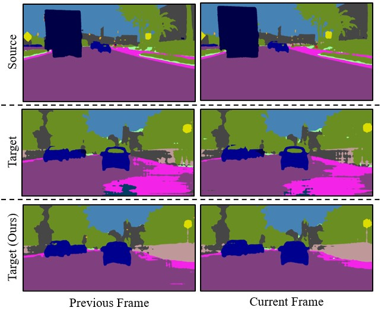

# Domain Adaptive Video Segmentation via Temporal Consistency Regularization

### Updates
- *07/2022*: The code of TPS [ECCV 2022] is available [here](https://github.com/xing0047/TPS). TPS is 3x faster than DA-VSN during training and notably surpasses DA-VSN during testing.

### Paper


[Domain Adaptive Video Segmentation via Temporal Consistency Regularization](https://openaccess.thecvf.com/content/ICCV2021/papers/Guan_Domain_Adaptive_Video_Segmentation_via_Temporal_Consistency_Regularization_ICCV_2021_paper.pdf) 
 
[Dayan Guan](https://scholar.google.com/citations?user=9jp9QAsAAAAJ&hl=en), [Jiaxing Huang](https://scholar.google.com/citations?user=czirNcwAAAAJ&hl=en&oi=ao),  [Xiao Aoran](https://scholar.google.com/citations?user=yGKsEpAAAAAJ&hl=en), [Shijian Lu](https://scholar.google.com/citations?user=uYmK-A0AAAAJ&hl=en)  
 School of Computer Science and Engineering, Nanyang Technological University, Singapore  
 International Conference on Computer Vision, 2021.
 
If you find this code useful for your research, please cite our [paper](https://openaccess.thecvf.com/content/ICCV2021/papers/Guan_Domain_Adaptive_Video_Segmentation_via_Temporal_Consistency_Regularization_ICCV_2021_paper.pdf):

```
@inproceedings{guan2021domain,
  title={Domain adaptive video segmentation via temporal consistency regularization},
  author={Guan, Dayan and Huang, Jiaxing and Xiao, Aoran and Lu, Shijian},
  booktitle={Proceedings of the IEEE/CVF International Conference on Computer Vision},
  pages={8053--8064},
  year={2021}
}
```

### Abstract
Video semantic segmentation is an essential task for the analysis and understanding of videos. Recent efforts largely focus on supervised video segmentation by learning from fully annotated data, but the learnt models often experience clear performance drop while applied to videos of a different domain. This paper presents DA-VSN, a domain adaptive video segmentation network that addresses domain gaps in videos by temporal consistency regularization (TCR) for consecutive frames of target-domain videos. DA-VSN consists of two novel and complementary designs. The first is cross-domain TCR that guides the prediction of target frames to have similar temporal consistency as that of source frames (learnt from annotated source data) via adversarial learning. The second is intra-domain TCR that guides unconfident predictions of target frames to have similar temporal consistency as confident predictions of target frames. Extensive experiments demonstrate the superiority of our proposed domain adaptive video segmentation network which outperforms multiple baselines consistently by large margins.

### Installation
1. Conda enviroment:
```bash
conda create -n DA-VSN python=3.6
conda activate DA-VSN
conda install -c menpo opencv
pip install torch==1.2.0 torchvision==0.4.0
```

2. Clone the [ADVENT](https://github.com/valeoai/ADVENT):
```bash
git clone https://github.com/valeoai/ADVENT.git
pip install -e ./ADVENT
```

3. Clone the repo:
```bash
git clone https://github.com/Dayan-Guan/DA-VSN.git
pip install -e ./DA-VSN
```

### Preparation 
1. Dataset:
* [Cityscapes-Seq](https://www.cityscapes-dataset.com/)
```bash
DA-VSN/data/Cityscapes/                       % Cityscapes dataset root
DA-VSN/data/Cityscapes/leftImg8bit_sequence   % leftImg8bit_sequence_trainvaltest
DA-VSN/data/Cityscapes/gtFine                 % gtFine_trainvaltest
```

* [VIPER](https://playing-for-benchmarks.org/download/): 
```bash
DA-VSN/data/Viper/                            % VIPER dataset root
DA-VSN/data/Viper/train/img                   % Modality: Images; Frames: *[0-9]; Sequences: 00-77; Format: jpg
DA-VSN/data/Viper/train/cls                   % Modality: Semantic class labels; Frames: *0; Sequences: 00-77; Format: png
```

* [SYNTHIA-Seq](http://synthia-dataset.cvc.uab.cat/SYNTHIA_SEQS/SYNTHIA-SEQS-04-DAWN.rar) 
```bash
DA-VSN/data/SynthiaSeq/                      % SYNTHIA-Seq dataset root
DA-VSN/data/SynthiaSeq/SEQS-04-DAWN          % SYNTHIA-SEQS-04-DAWN
```

2. Pre-trained models:
Download [pre-trained models](https://github.com/Dayan-Guan/DA-VSN/releases/tag/Latest) and put in ```DA-VSN/pretrained_models```

### Optical Flow Estimation
* For quick preparation: The estimated optical flow can be accessed [here](https://drive.google.com/drive/folders/1i_-yw9rS7-aa7Cn5ilIMbkUKwr1JpUFA?usp=sharing) and unzip in ```DA-VSN/data```


1. Clone the [flownet2-pytorch](https://github.com/NVIDIA/flownet2-pytorch):
```bash
git clone https://github.com/NVIDIA/flownet2-pytorch.git
```

2. Download [pre-trained FlowNet2](https://github.com/NVIDIA/flownet2-pytorch) and put in ```flownet2-pytorch/pretrained_models```

```bash
DA-VSN/data/Cityscapes_val_optical_flow_scale512/  % unzip Cityscapes_val_optical_flow_scale512.zip
```

3. Use the [flownet2-pytorch](https://github.com/NVIDIA/flownet2-pytorch) to estimate optical flow

### Evaluation on Pretrained Models
* VIPER → Cityscapes-Seq: 
```bash
cd DA-VSN/davsn/scripts
python test.py --cfg configs/davsn_viper2city_pretrained.yml
```

* SYNTHIA-Seq → Cityscapes-Seq: 
```bash
python test.py --cfg configs/davsn_syn2city_pretrained.yml
```

### Training and Testing
* VIPER → Cityscapes-Seq: 
```bash
cd DA-VSN/davsn/scripts
python train.py --cfg configs/davsn_viper2city.yml
python test.py --cfg configs/davsn_viper2city.yml
```

* SYNTHIA-Seq → Cityscapes-Seq: 
```bash
python train.py --cfg configs/davsn_syn2city.yml
python test.py --cfg configs/davsn_syn2city.yml
```

## Acknowledgements
This codebase is heavily borrowed from [ADVENT](https://github.com/valeoai/ADVENT) and [flownet2-pytorch](https://github.com/NVIDIA/flownet2-pytorch).

## Contact
If you have any questions, please contact: dayan.guan@outlook.com
